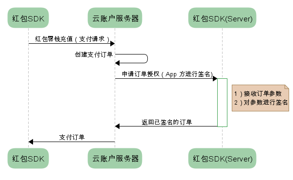

# payment-auth

支持商户使用自有支付宝和微信账号收款

## 业务流程




流程说明：

- App开发者可以提供服务端`红包SDK(Server)`来使用自有支付宝和微信账号收款。
- App开发者需要为 `红包SDK(Server)` 提供REST API，供云账户访问，以便为支付订单生成签名。
- 一旦用户在`红包SDK`中支付完成，云账户服务器会首先接收渠道通知，然后云账户会对用户支付成功事件进行通知，App开发者需要对此事件订阅。关于事件订阅，可参考 [红包消息推送](https://github.com/YunzhanghuOpen/redpacket-webhooks) 文档。
- App开发者调通功能上线前，需要联系云账户技术同学，告知期望启用的支付宝、微信支付等具体通道，并告知对应商户号。
客服热线: 400-6565-739
技术支持QQ群: 366135448

## 红包SDK(Server) 

`红包SDK(Server)` 用于对支付订单签名，由一个接口支持支付宝和微信支付等多种支付方式的订单生成签名，以便认证服务。

### 接口定义

- 接口: http(https)://`app.host.com`/rpserversdk/payment/auth
- 方法: POST
- 输入：header为：Content-Type: application/json
   输入参数是一个JSON对象，有属性 channel 和 orderInfo。channel 告知支付方式，其取值包括ALIPAY，WECHAT等。输入JSON对象的 orderInfo 的具体构成，则由对应的支付方式决定，代表发起支付时的标准的请求对象。
- 输出：签名值 sign，string 类型，其生成方法参考对应支付方式的标准方法，针对上述 orderInfo 对象生成签名。

举例：

云账户发出的请求

```shell
curl -X POST -H "Content-Type: application/json" -d '{
"channel":"ALIPAY",
"orderInfo": {
  "service":"mobile.securitypay.pay",
  "partner":"",
  "_input_charset":"utf-8",
  "sign_type":"RSA",
  "sign":"",
  "notify_url":"https:\/\/***REMOVED***",
  "out_trade_no":"3242398127981",
  "subject":"\u5546\u54c1\u4ed8\u6b3e",
  "payment_type":"1",
  "seller_id":"",
  "total_fee":100,
  "body":"\u5546\u54c1\u4ed8\u6b3e\u8be6\u60c5",
  "it_b_pay":"30m"
}
}' "https://app.host.com/rpserversdk/payment/auth"
```

### 集成

Demo 下载

|版本|说明|
|---|----|
|[PHP](php)|有效，目前仅支持支付宝，微信测试中|
|[Java](java) |敬请期待|
|[Node.js](nodejs) |敬请期待|
|[Go](go) |敬请期待|

### 对接步骤

1. 请商户方把自己的支付宝（微信）商户号发给云账户
1. 商户方根据文档开发好接口后，把接口地址发给云账户

### 常见问题

1. 支付宝的签名结果要进行 URL encoding，否则会产生“交易订单处理失败，请稍后重试”的报错。


